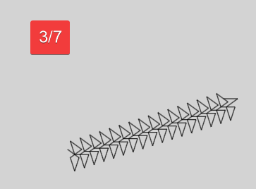

# decimal_periodic_canvas_line
 Una curiosidad de canvas , donde se asigna una division para conseguir un numero decimal, y dibuja una linea en base al digito correspondiente, creando patrones curiosos

 Ejemplo de una division y su patron

